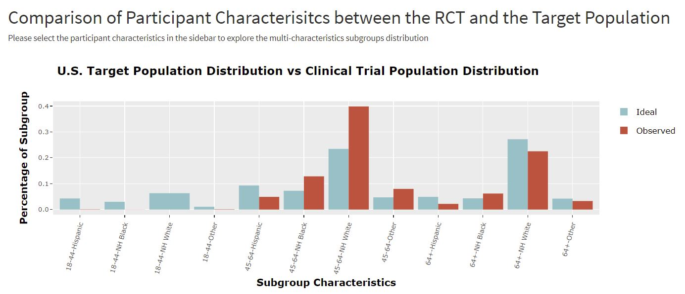
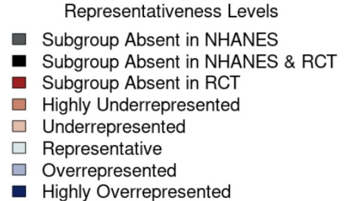
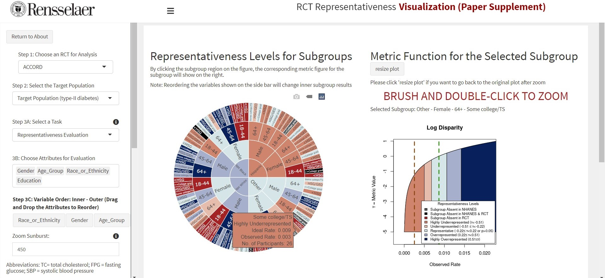

# Clinical Trial Representation

 

Quantify representativeness in randomized clinical trials and provide insights to improve the clinical trial equity and health equity

<!-- TABLE OF CONTENTS -->
## Contents

1. [Description](#description)
1. [Visualization Tool](#visualization-tool)
1. [Example RCTs](#example-rcts)
1. [Sample Visualization](#RCT-Representativeness-Visualization-Supplement-2021)
1. [Statistical Results](#statistical-results)
1. [Contact](#contact)
1. [License](#license)
1. [Acknowledgments](#acknowledgments)

<!-- ABOUT THE PROJECT -->
## Description
We develop randomized clinical trial (RCT) representativeness metrics based on Machine Learning (ML) Fairness Research. Visualizations and statistical tests based on proposed metrics enable researchers and physicians to rapidly visualize and assess potential misrepresentations/inequities in RCTs for subgroups. The approach enables users to determine overrepresentation, underrepresentation, and exclusion of subgroups indicating potential limitations of RCTs. The method could help support evaluation of existing RCTs, design of new RCTs, monitoring of RCT recruitment, and applicability of RCT results to participants.

### What's the problem?
Within the field of RCT research, there has been ongoing concern that RCTs which lack a diversity of participants may not provide clear evidence of efficacy and safety for new interventions in underrepresented or missing subpopulations. To date, there has been insufficient means to quantify the inequity between those who get enrolled into RCTs and the broader population who could benefit from the new intervention.

### How can technology help?
Extensive research in ML Fairness has created metrics for quantifying inequities in trained ML classification models and for creating novel ML approaches to address these inequities.

Our novel insight is that assignment of a subject to a RCT can be regarded as a classification function that is random. Applying ML Fairness metrics to this classification problem creates novel representativeness metrics for RCTs and other clinical studies. The representativeness metrics capture how well the actual assignment of subjects to a RCT matches of a hypothetical random assignment.

### The solution
We compare the observed rate in the RCT for the subgroup to the hypothetical ideal rate in an equitable RCT in which participants are assigned truly randomly to the clinical trial.  By considering assignment to the clinical trial as a random classification function, we develop standardized metrics based on variations of ML fairness metrics, focusing here on "Disparate Impact." The resulting metrics are functions of disease-specific observed and ideal rates of assignment of protected subgroups to the RCT. 

## Visualization Tool

You can run the example studies on [**RCT Representativeness Visualization (Paper Supplement)**](https://miao-qi-rpi-app.shinyapps.io/EquityBrowser/).

The tool can
1. Measure representativeness of any subgroup of interest in randomized clinical trials
2. Visualize misrepresentation/inequity for subgroups
3. Compare inequities within/among studies

The R codes are available in the folder **Visualization Codes**.

### Prerequisites

What things you need to install the software and how to install them:
1. A software/server that can run R shiny codes
2. R packages used in the codes (available in *Source.R*)

## Example RCTs
We apply the proposed RCT representativeness metrics to three landmark clinical trials released in the last decade: Action to Control Cardiovascular Risk in Diabetes (**ACCORD**), Antihypertensive and Lipid-Lowering Treatment to Prevent Heart Attack Trial(**ALLHAT**), and Systolic Blood Pressure Intervention Trial (**SPRINT**). All patient data are obtained through the [Biologic Specimen and Data Repositories Information Coordinating Center (BioLINCC)](https://biolincc.nhlbi.nih.gov/home/).

## RCT Representativeness Visualization (Paper Supplement)

  

<em>The distributions of subgroups defined over age and race/ethnicity in both target population and ACCORD</em>

It demonstrates the distributions of patients from different age and race/ethnicity groups in the RCT ACCORD and the target population. This figure clearly identifies that young patients are missing from the clinical trial. Also, the higher red bin shows that the subgroup may be overrepresented in the RCT (e.g. non-Hispanic white subjects age 45-64), while the higher green bin shows that the subgroup has the potential to be underrepresented in the RCT (e.g. Hispanic participants age 45-64). The wider green bin means that the subgroup is missing from the clinical trial (e.g. non-Hispanic white patients age 18-44).

  

<em>Color representation of representativeness levels</em>

In our visualization, grey indicates that no people with selected protected attributes exist in NHANES; black means that the subgroup is missing in both NHANES and RCT; dark red represents the absent subgroup from the RCT; light orange and dark orange point out that some subgroups are not sufficiently represented and may be at risk of being insufficiently recruited into and represented in the clinical trial cohort; on the other hand, dark blue and light blue identify the potential advantaged subgroups which may make inefficient treatment seem helpful or vice versa; teal shows that the subgroup is equitably represented in the clinical trial. 

  

<em>The Log Disparity representativeness levels of subgroups defined over race/ethnicity, gender, age, and education and the corresponding function of observed rate for female subjects from other races with some college/technical school education and age over 64 in ACCORD, with significance level = 0.05,lower metric threshold = 0.2, and upper metric threshold = 0.4.</em>

This figure presents the representativeness levels of ACCORD subgroups defined by race/ethnicity, gender, age, and education from the inner ring to the outer ring using the Log Disparity metric. By hovering the pointer over the target subgroup areas on the sunburst, the representativeness label, ideal rate, and observed rate of the subgroups will show on the screen. Additionally, the corresponding math function of observed rates will also show on the side. The green line indicates the ideal rate and the brown line indicates the current RCT observed rate on the figure.

  

<em>The Normalized Parity representativeness levels of subgroups defined over race/ethnicity, gender, age, and education and the corresponding function of observed rate for female subjects from other races with some college/technical school education and age over 64 in ACCORD, with significance level = 0.05,lower metric threshold = 0.1, and upper metric threshold = 0.2.</em>

This figure presents the representativeness levels of ACCORD subgroups defined by race/ethnicity, gender, age, and education from the inner ring to the outer ring using the Normalized Parity metric. 

## Statistical Results
Subgroup data of ACCORD, ALLHAT, and SPRINT are summarised with the subgroups' charactersitics, observed rates in the RCT, ideal rates, Log Disparity value, group size, p-value, and BH p-value. 

The results are available in the folder **Statistical Results for Example Studies** as csv files.

<!-- CONTACT -->
## Contact

Miao Qi  - qim@rpi.edu

Project GitHub Link: [ClinicalTrialEquity](https://github.com/TheRensselaerIDEA/ClinicalTrialEquity)

## License

This project is licensed under the Apache 2 License

## Acknowledgments

* This work was primarily funded by IBM Research AI Horizons Network with the Rensselaer Institute for Data Exploration and Applications (IDEA)
