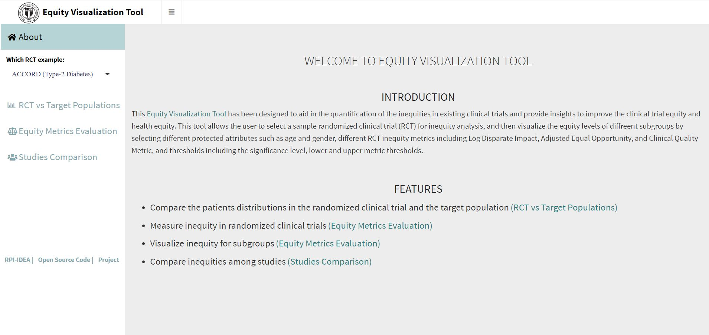

***Equity Visualization Tool***

# Visualizatoin Codes 

## Installation
1. ~ [Download R](https://www.r-project.org/).
2. ~ [Download RStudio](https://www.rstudio.com/products/rstudio/download/).
3. ~ [Download Visualization Codes](https://github.com/TheRensselaerIDEA/ClinicalTrialEquity/tree/master/Visualization%20Codes).
4.	Open RStudio.
5.  Open app.R.
6.  Run App.
